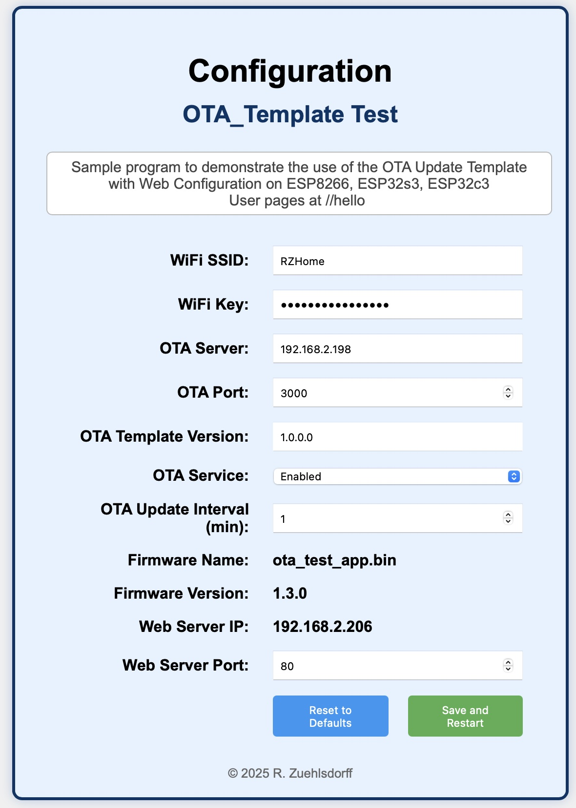

# OTA Update System for ESP8266, ESP32-C3, ESP32-S3

This project provides a complete solution for **Over-the-Air (OTA) firmware updates** for ESP8266/ESP32C3/ESP32S3 devices, including a web-based configuration interface and a Node.js OTA server.
The Web Server provides a user hook for easy custom extensions to the server, e.g. for additional configurations. The program OTA_TEST.cpp serves as an example for the integration of the OTA update 
and configuration services into a custom application. No changes to the node.js OTA server are required.

REMARK:  The framework should also fit other ESP32 variants, but has only been tested for the chip versions stated above.

---

## Contents

- [Overview](#overview)
- [File Structure](#file-structure)
- [OTA Framework Setup](#ota-framework-setup)
- [Web Configuration Interface](#web-configuration-interface)
- [OTA Server Setup (Node.js)](#ota-server-setup-nodejs)
- [How OTA Works](#how-ota-works)
- [Custom Extensions](#custom-extensions)
- [Troubleshooting](#troubleshooting)
- [License](#license)

---

## Overview

- **OTA Framework**: Connects to WiFi, checks for new firmware on the OTA server and updates itself, if a newer version is available. All OTA related settings can be configured via a web interface.
- **OTA Server (Node.js)**: Hosts the firmware binary and version files for download, serving them to devices for updates on request.

- A more detailed description of the OTA framework and the OTA server could be found in the different sources and configuration files. The file OTA_TEST.cpp serves as an example to demonstrate the usage of the OTA Template, the node.js OTA Server and the extension of the integrated WebServer to host and process user specific pages. Therefore if you want to cretae your own OTA enabled application it is recommended to start with the OTA_TEST file and add your specific code to the provided user hooks.

- Please note that the current version of the OTAServer just provides ota updates from the subdirectory "updates". To accomodate update packages for multiple ota enabled applications just provide more specific names than "firmware.bin" and "firmware.bin.version" in the base configuration file "config.h" of the OTA enabled application. Than place the bin and version files in the updates directory of the node.js OTA Server. It is also suggested to name the firmware bin file according to application and chip variant. An update from a firmware version intended for a differen chip variant will certainly fail! 

That's all - enjoy!
 
---

## File Structure

### OTA Framework

```
OTA-Template/
├── src/
│   ├── config.h              # Configuration macros and defaults
│   ├── OTA_WebConfig.h/cpp   # Configuration logic and web server
│   ├── OTA_WebForm.h         # HTML for the configuration web page
│   ├── OTA_Template.h/cpp    # OTA update logic
│   ├── OTA_TEST.cpp          # Main application entry point
│   └── ...                   # Other source files
└── README                    # This file
```

### OTA Server Project

```
OTAServer/
├── ota-server.js             # Node.js OTA server
└── updates/
    ├── firmware.bin          # Firmware binary to be served
    └── firmware.bin.version  # Text file with the firmware version (e.g., 1.1.0)
```

---

## OTA Framework Setup

1. **Clone or download this repository.**
2. Open the project in Arduino IDE or PlatformIO.
3. Edit `src/config.h` to set your default WiFi and OTA server settings.
4. Connect your ESP board to your computer.
5. Select the correct board and port in your IDE.
6. Upload the firmware to your ESP board.

---

## Web Configuration Interface

1. **Connect the ESP board to your WiFi network.**
   - By default, it uses the SSID and password defined in `config.h`.
2. **Find the device's IP address.**
   - Check your router or use a serial monitor.
3. **Open the configuration page in your browser:**
   - Go to `http://<device-ip>/ota`
4. **Configure settings as needed and save.**
   - The device will restart if required.

<p align="center">
  
</p>

---

## OTA Server Setup (Node.js)

1. **Install Node.js**  
   Download and install from [nodejs.org](https://nodejs.org/).

2. **Set up the OTA server directory:**
   ```sh
   mkdir OTAServer
   cd OTAServer
   mkdir updates
   ```

3. **Place your firmware and version file in `updates/`:**
   - `firmware.bin` — The compiled firmware binary.
   - `firmware.bin.version` — A text file containing the version string (e.g., `1.1.0`).

4. **Create `ota-server.js` with the following content:**
   (See `ota-server.js` in this repository for the full code.)

5. **Install dependencies:**
   ```sh
   npm init -y
   npm install express
   ```

6. **Start the OTA server:**
   ```sh
   node ota-server.js
   ```
   The server will listen on port 3000 by default and serve files from the `updates` directory.

---

## How OTA Works

- The ESP device periodically checks the OTA server for a new firmware version.
- It compares its defined version number with the version number found in the version file on the OTA server. 
  If a newer version is found, it downloads `firmware.bin` and updates itself.
  The version numbereing schema has to be "n1.n2.n3.n4", e.g. "0.9.0.8" or "1.2.0.5". Here the second example 
  is "greater" than the first. The compare function is located in OTA_Template.cpp and can be changed if needed.
- Be aware that the configuration settings stored in EEPROM will not be cleared during the update! 
  All configuration (WiFi, OTA server, update interval, etc.) can be managed via the web interface at `/ota`
  endpoint and changed individually or resetted to the default values stored in the file config.h.

---

## Custom Extensions

The OTA_TEST.cpp source provides hooks for custom extensions to the application and demonstrates the use in the source code.
The function `userSetup()` will be called once the `setup()` of the OTA Framework is completed. 

```cpp
void userSetup() {
  // TODO: Insert your own initialization code here
  registerCustomEndpoint("/hello", []() {
    server.send(200, "text/plain", "Hello, world!");
    }, HTTP_GET);

    pinMode(LED_BUILTIN, OUTPUT);
}
```
The function `userLoop()` is called after the call of the event loop of the OTA framework.

```cpp
void userLoop() {
  // TODO: Insert your own cyclic tasks here
  digitalWrite(LED_BUILTIN, HIGH);  // turn the LED on (HIGH is the voltage level)
  delay(1000);                      // wait for a second
  digitalWrite(LED_BUILTIN, LOW);   // turn the LED off by making the voltage LOW
  delay(1000);                      // wait for a second
}
```

You can add your own web endpoints and logic by using the `registerCustomEndpoint()` function in your `userSetup()` (see `OTA_TEST.cpp`):

```cpp
registerCustomEndpoint("/hello", []() {
  server.send(200, "text/plain", "Hello, world!");
}, HTTP_GET);
```

---

## Troubleshooting

- **Device not connecting to WiFi?**  
  Double-check your SSID and password in `config.h` or via the web interface.

- **OTA not working?**  
  - Ensure the OTA server is running and accessible from the ESP board.
  - Check that `firmware.bin` and `firmware.bin.version` exist in the `updates` directory.
  - Make sure the OTA server port matches `OTA_PORT` in `config.h`.

- **Web interface not loading?**  
  - Confirm the device's IP address.
  - Ensure your computer is on the same network as the ESP board.

---

## License

MIT License

---

## Author

R. Zuehlsdorff, 2025

